## GraphQL Things

A decentralized, encrypted Apollo Link for the internet of things compatible with [Beaker Browser](https://beakerbrowser.com).

#### The problems with cloud-based IOT Apps

1. You can't connect to your device if there is no internet.
2. you don't own your data.

#### The Solution
GraphQL Things ditch the cloud in favour of an end-to-end encrypted P2P connection to your device.

With P2P communication there comes an additional challenge - how do we securely connect to the device?

It is impractical to expect each consumer to buy a domain name to get an SSL Cert for their household IOT device.

Instead of Certificate Authorities GraphQL Things use a unique cryptographic QR code which you scan in Beaker Browser to immediately establish a secure GraphQL connection to the device. This has the added advantage that unlike local http servers, you will never have to type in a device ip address because Graphql Things uses the P2P network and public/private key cryptography to automatically discover and securely connect to your device.

With GraphQL Things you, the consumer maintain complete ownership of your data since your data is never stored on a cloud server and all your communication to your device is end-to-end encrypted and you can always connect to your device, even when the internet is down.

<p align="center">
  
</p>

## Features
* **Decentralized** - GraphQL Things require no centralized servers, no DNS and no Certificate Authorities. Users discover and connect to their GraphQL Things through the P2P network with or without the internet.
* **End-to-end Encrypted** - GraphQL Things use [Triple Diffie Helman](https://signal.org/docs/specifications/x3dh/) and 256-bit [Eliptical Curve Cryptography](https://www.globalsign.com/en/blog/elliptic-curve-cryptography/) to establish authenticated end-to-end encrypted connections.
* **Secure Onboarding** - "Invite" QR Codes containing cryptographic key data allow users to to establish initial trust even when their internet is down.
* **Data Ownership** - you, the consumer maintain complete ownership of your data since it is never stored on a cloud server and all communication to your device is end-to-end encrypted.
<!-- * **NAT-traversing** - GraphQL Things use [WebRTC and ICE](https://www.youtube.com/watch?v=7qAQuC9muf8) to establish connections directly from the device to any authorized client. -->
* **Beaker Browser Ready** - GraphQL Things are built on the [Dat P2P protocol](https://datproject.org/) so any GraphQL Thing can be queried directly from the Dat-based [Beaker Browser](https://beakerbrowser.com/).


## Security Disclaimer

GraphQL Things' cryptography has not been security audited and should not be used in production until it has. Use at your own risk.

## Useage

### Apollo Client

```js
import { ApolloClient } from 'apollo-client'
import { InMemoryCache } from 'apollo-cache-inmemory'

import { ThingLink, parseInviteCode } from 'graphql-things'

/*
 * client identity keys can be parsed from invite codes created on the
 * server (see "Apollo Server" example below).
 */
const { identityKeys } = parseInviteCode(YOUR_INVITE_CODE)

const client = new ApolloClient({
  link: ThingLink({
    identityKeys,
    peerIdentityPublicKey: YOUR_HOST_ECDH_PUBLIC_KEY,
    options: { reconnect: true },
  }),
  cache: new InMemoryCache(),
})
```

See also [Apollo Client: Connecting your client to React](https://www.apollographql.com/docs/react/essentials/get-started.html#creating-provider)

### Apollo Server

```js
import Dat from '@beaker/dat-node'
import wrtc from 'wrtc'

import { execute, subscribe } from 'graphql'
import { SubscriptionServer } from 'subscriptions-transport-ws'

import { GraphQLThing, getInviteCode, createECDHKey } from 'graphql-things'

import * as qrcode from 'qrcode-terminal'

import schema from './schema'

// instantiate the dat node
const dat = Dat.createNode({
  path: './.dat-data',
})

const datPeers = dat.getPeers(YOUR_DAT_URL)

const inviteKeys = []

/*
* return true to allow the connection if an authorized user can be found with
* the identity public key.
*/
const authenticate = ({ peerIdentityPublicKey }) => {
  console.log(`\n\nNew connection from ${peerIdentityPublicKey}`)
  /*
   * Replace this return with your authentication logic to prevent unauthorized
   * access.
   */
  return inviteKeys.includes(peerIdentityPublicKey)
}

/*
 * In production you should create and save new host identityKeys on first
 * startup with:
 *
 * `fs.writeFileSync(PATH_TO_YOUR_KEYS_FILE, await createECDHKey())`
 *
 * Subsequent host restarts should load the identityKeys from your keys file.
 */
const identityKeys = fs.readFileSync(PATH_TO_YOUR_KEYS_FILE, 'utf8')

const graphqlThing = GraphQLThing({
  datPeers,
  identityKeys,
  authenticate,
  wrtc,
})

const options = {
  execute,
  subscribe,
  schema,
  // the onOperation function is called for every new operation
  // and we use it to inject context to track the session and
  // user
  onOperation: async (msg, params, socket) => ({
    ...params,
    context: {
      sessionID: socket.sessionID,
      peerIdentityPublicKey: socket.peerIdentityPublicKey,
    },
  }),
}

SubscriptionServer.create(options, graphqlThing)

// create a new cryptographic invite code
createInvite({
  identityKeys,
}).then((invite) => {
  // Store the invite key so it can be checked in authentication
  inviteKeys.push(invite.keys.publicKey)
  /*
   * Display the invite code as a QR Code in the command line so the user can
   * copy it into their client and securely connect
   */
  qrcode.generate(invite.code, { small: true }, (qr) => {
    console.log(
      `Listening for Connections\n\nPublic Key: ${identityKeys.publicKey}\n\n`
      + 'Invite Code QR Code:\n\n'
      + qr
      + '\n\n'
      + 'Invite Code String:\n\n'
      + invite.code,
    )
  })
})
```
